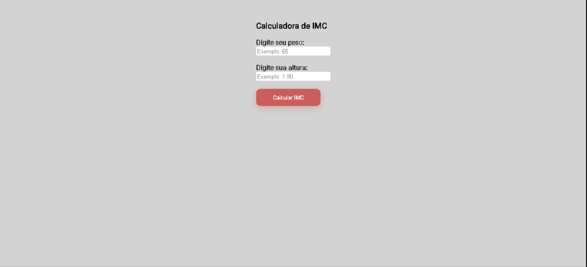

# IMC
<<<<<<< HEAD
A simple site to calculate the BMI, with Css personalization. When you insert your weigth(Kg) and your height(m), you press the button and it will calculate your BMI. It´s going to show the result and clean the inputs. The Javascript was done along with the course of [Sujeito Programador](https://sujeitoprogramador.com/)  
=======
A simple site to calculate the BMI, with Css personalization. When you insert your weigth(Kg) and your height(m), you press the button and it will calculate your BMI. It´s going to show the result and clean the inputs. The Javascript was done along with the course of [Sujeito Programador](https://sujeitoprogramador.com/)
>>>>>>> c0fbad5f2ef4e2b256e51e986df6132142b41ebb

Um site simples para calcular o IMC, com personalização de CSS. Quando você insere seu peso (Kg) e sua altura (m), pressiona o botão e ele calcula seu IMC. Vai mostrar o resultado e limpar as entradas. A parte de Javascript foi feita junto com o curso do [Sujeito Programador](https://sujeitoprogramador.com/)
 

 
IMC calculated
<<<<<<< HEAD

=======

>>>>>>> c0fbad5f2ef4e2b256e51e986df6132142b41ebb
